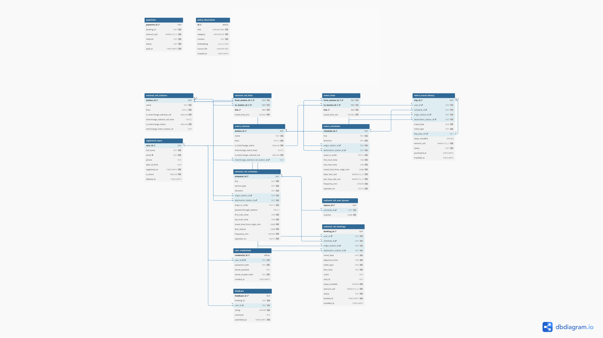

# Section 1 — ER Diagram

The diagram below illustrates the comprehensive database schema designed for the transit system, capturing the relationships between all major entities.




# Section 2 — Normalisation Justification

## 2.1 Design Goal

The relational database design of TransitFlow follows Third Normal Form (3NF) as the main design principle. The goal is to reduce unnecessary data duplication, maintain data consistency, and avoid common database anomalies such as insert anomalies, update anomalies, and delete anomalies.

The schema separates the major entities of the system into different tables, including users, credentials, stations, station links, schedules, seat layouts, bookings, metro travel history, payments, feedback, and policy documents. This separation allows each table to focus on one main type of data and reduces the risk of mixing unrelated information in the same relation.

At the same time, TransitFlow keeps a small number of controlled denormalised fields in transaction-related tables, such as `amount_usd` and `stops_travelled`. These fields are stored directly in booking and travel history records to preserve the actual transaction state at the time of purchase.

---

## 2.2 First Normal Form (1NF)

First Normal Form requires each record to be uniquely identifiable and each field to store values in a structured and consistent way. In TransitFlow, all major tables have clear primary keys:

| Table | Primary Key | Purpose |
|---|---|---|
| `registered_users` | `user_id` | Stores user profile data |
| `user_credentials` | `credential_id` | Stores login and security credentials |
| `national_rail_stations` | `station_id` | Stores national rail station data |
| `metro_stations` | `station_id` | Stores metro station data |
| `national_rail_schedules` | `schedule_id` | Stores national rail schedule data |
| `metro_schedules` | `schedule_id` | Stores metro schedule data |
| `national_rail_bookings` | `booking_id` | Stores national rail booking records |
| `metro_travel_history` | `trip_id` | Stores metro travel records |
| `payments` | `payment_id` | Stores payment records |
| `feedback` | `feedback_id` | Stores user feedback |

Most fields store single values, such as `email`, `phone`, `travel_date`, `fare_class`, `seat_id`, `amount_usd`, `method`, `status`, and `paid_at`.

Some schedule-related tables use PostgreSQL structured types such as `TEXT[]` and `JSONB`. For example, `stops_in_order TEXT[]` stores the ordered list of stops in a schedule, while `travel_time_from_origin_min JSONB` stores the travel time from the origin station to each stop. `fare_classes JSONB` stores fare class information for national rail schedules, and `coaches JSONB` stores seat layout information.

From a strict theoretical relational model, these fields could be further decomposed into separate child tables such as `schedule_stops` or `seat_layout_details`. However, in this project, these values are usually accessed as one complete schedule or one complete seat layout. Therefore, storing them as structured attributes is a practical design choice that improves query simplicity and performance while still keeping the schema organised.

---

## 2.3 Second Normal Form (2NF)

Second Normal Form requires that all non-key attributes fully depend on the whole primary key. This is especially important for tables with composite primary keys.

Most tables in TransitFlow use a single-column primary key, such as `user_id`, `schedule_id`, `booking_id`, `trip_id`, and `payment_id`. Therefore, partial dependency is naturally avoided in these tables.

For station connection tables, TransitFlow uses composite primary keys:

| Table | Composite Primary Key | Non-key Attribute |
|---|---|---|
| `national_rail_links` | `(from_station_id, to_station_id, line)` | `travel_time_min` |
| `metro_links` | `(from_station_id, to_station_id, line)` | `travel_time_min` |

In these tables, `travel_time_min` depends on the full combination of the origin station, destination station, and line. Knowing only the origin station is not enough to determine the travel time, because one station can connect to multiple other stations. Knowing only the line is also not enough, because the same line contains multiple station-to-station segments. Therefore, the non-key attribute is fully dependent on the whole composite key, which satisfies 2NF.

---

## 2.4 Third Normal Form (3NF)

Third Normal Form requires that non-key attributes do not depend on other non-key attributes. In other words, each non-key field should directly describe the entity identified by the primary key.

In `registered_users`, fields such as `full_name`, `email`, `phone`, `date_of_birth`, `registered_at`, `is_active`, and `deleted_at` directly describe the user identified by `user_id`. Login credentials are not stored in the same table. Instead, password and security question data are separated into `user_credentials`, which stores `password_hash`, `secret_question`, and `secret_answer_hash`.

This separation improves both normalisation and security. User profile data and authentication data can be updated independently. For example, changing a user phone number or email does not require modifying password-related fields.

The same design principle is applied to schedules and bookings. `national_rail_schedules` stores reusable schedule information such as line, service type, direction, station order, travel time, and fare classes. Actual user transactions are stored in `national_rail_bookings`. A booking references a schedule through `schedule_id` instead of duplicating all schedule details in every booking record.

Similarly, metro travel records are stored in `metro_travel_history`, while reusable metro schedule data are stored in `metro_schedules`. This avoids repeating schedule information in every trip record.

Payment information is also stored separately in `payments`. This allows booking status and payment status to be managed independently. For example, a booking may be `confirmed` or `cancelled`, while a payment may be `paid` or `refunded`. In the current schema, `payments.booking_id` is used as a logical reference to a booking record, although it is not explicitly declared as a foreign key.

---

## 2.5 Referential Integrity

The schema uses primary keys and foreign keys to maintain relationships between major entities.

For national rail bookings, `national_rail_bookings.user_id` references `registered_users.user_id`, `schedule_id` references `national_rail_schedules.schedule_id`, and both `origin_station_id` and `destination_station_id` reference `national_rail_stations.station_id`. This ensures that each booking is associated with a valid user, schedule, and pair of stations.

For metro travel history, `metro_travel_history.user_id` references `registered_users.user_id`, `schedule_id` references `metro_schedules.schedule_id`, and both origin and destination station IDs reference `metro_stations.station_id`. The `day_pass_ref` field also references `metro_travel_history.trip_id`, allowing day pass related trips to be linked to an existing metro travel record.

For station connectivity, `national_rail_links` references `national_rail_stations`, while `metro_links` references `metro_stations`. This ensures that station-to-station links cannot point to non-existent stations.

The `feedback` table stores user feedback with a foreign key to `registered_users.user_id`. This allows feedback records to be associated with valid users.

---

## 2.6 Controlled Denormalisation

Although the schema mainly follows 3NF, TransitFlow intentionally stores some calculated values in transaction tables. The most important examples are:

| Table | Denormalised Field | Reason |
|---|---|---|
| `national_rail_bookings` | `amount_usd` | Stores the actual fare charged at booking time |
| `national_rail_bookings` | `stops_travelled` | Stores the actual number of stops travelled |
| `metro_travel_history` | `amount_usd` | Stores the actual metro fare or pass amount |
| `metro_travel_history` | `stops_travelled` | Stores the actual number of metro stops travelled |

These fields could theoretically be recalculated from schedule data, station order, and fare rules. However, recalculating them every time would create a risk for historical transaction records.

Transit fares, discounts, service rules, and fare classes may change over time. If an old booking were recalculated using the newest fare rule, the result might not match the amount that the passenger actually paid. To avoid this problem, TransitFlow stores `amount_usd` and `stops_travelled` directly in the transaction record at the time of booking or travel.

This is a controlled denormalisation decision. It improves the reliability of historical transaction records and supports financial auditing, because the system can preserve the original charged amount even if fare rules are changed later.

---

## 2.7 Summary

Overall, TransitFlow’s relational schema follows the main principles of 3NF by separating user profiles, credentials, stations, station links, schedules, bookings, metro travel history, payments, and feedback into different tables. This reduces redundancy, improves data consistency, and prevents unrelated data from being stored together.

The schema also uses foreign keys to maintain referential integrity for users, stations, schedules, bookings, and travel records. At the same time, controlled denormalisation is applied to transaction records through fields such as `amount_usd` and `stops_travelled`. This design preserves historical fare information and ensures that past bookings remain accurate even if future schedules or fare policies change.

Therefore, the TransitFlow relational design balances normalisation, data integrity, query efficiency, and practical transaction requirements.

# Section 3 — Graph Database Design Rationale

## 3.1 Nodes, Relationships, and Properties

TransitFlow uses Neo4j to model the transportation network as a graph. The graph structure consists of nodes, relationships, and properties.

### Nodes

The system uses two node labels:

* MetroStation
* NationalRailStation

Each node represents a physical transportation station within the network.

Examples:

text
(MetroStation {station_id: "MS01"})
(MetroStation {station_id: "MS02"})
(NationalRailStation {station_id: "NR01"})

Stations are modeled as nodes because they represent distinct locations that can be connected through routes and transfers.

### Relationships

TransitFlow uses two relationship types:

#### LINK_TO

Represents a direct connection between two stations.

Example:

text
(MS01)-[:LINK_TO]->(MS02)

#### INTERCHANGE_WITH

Represents a transfer connection between the metro network and the national rail network.

Example:

text
(MS05)-[:INTERCHANGE_WITH]->(NR01)

The relationship is created in both directions to support bidirectional transfers.

### Properties

Node properties store station information:

text
station_id
name
lines

Relationship properties store routing information:

text
travel_time_min
cost_usd
standard_fare_usd
first_fare_usd
transfer_time_min

For example:

text
(MS01)-[:LINK_TO {
    travel_time_min: 5,
    cost_usd: 0.30
}]->(MS02)

These properties allow routing algorithms to calculate travel time, ticket cost, and transfer penalties directly from the graph.

---

## 3.2 Why a Graph Database Instead of a Relational Database

TransitFlow uses a graph database because route planning and network traversal are naturally graph problems.

In Neo4j, stations are modeled as nodes and connections are modeled as relationships. This structure allows graph algorithms such as Dijkstra's algorithm to operate directly on the transportation network.

For example, finding the shortest route between two stations involves traversing connected nodes while minimizing the accumulated travel time stored in the relationship properties.

In a relational database, the same operation would require recursive Common Table Expressions (Recursive CTEs) and repeated joins across station and link tables.

Example:

sql
WITH RECURSIVE ...

As the transportation network grows, recursive joins become increasingly complex and difficult to maintain.

By contrast, graph databases are specifically optimized for traversal-based queries. Algorithms such as Dijkstra can efficiently explore connected paths without repeatedly joining multiple tables.

Therefore, Neo4j provides a more natural and scalable solution for routing and path-finding operations within TransitFlow.

---

## 3.3 Query Type 1: Shortest Path Search

One important graph query in TransitFlow is shortest-path routing.

Example:

text
Origin: MS01
Destination: NR05

The system searches through LINK_TO and INTERCHANGE_WITH relationships and calculates the total travel time using the travel_time_min property.

The graph model makes this query straightforward because stations are already connected through explicit relationships.

A shortest-path algorithm such as Dijkstra can traverse the graph and identify the route with the minimum total travel time.

This type of query would be significantly more complex in a relational database because the system would need recursive joins to discover possible routes.

---

## 3.4 Query Type 2: Interchange Route Search

A second important query type is interchange routing.

Example:

text
Find a route from a metro station to a national rail station with the fewest transfers.

This query relies on the INTERCHANGE_WITH relationships that connect the two transportation networks.

Because transfer connections are explicitly represented in the graph, Neo4j can efficiently identify routes that minimize the number of interchanges.

The graph structure makes it easy to explore alternative paths and compare transfer counts.

This is particularly useful when users prefer fewer transfers even if the overall travel time is slightly longer.

---

## 3.5 Node Identity

The unique identifier for all station nodes is:

text
station_id

Examples:

text
MS01
MS02
NR01
NR05

The station_id property is used because it is guaranteed to be unique within the transportation network.

Station names are not used as identifiers because multiple stations could potentially share similar names or naming conventions.

Using station_id ensures consistency across both PostgreSQL and Neo4j and allows reliable node matching during graph construction and query execution.

---

## 3.6 Summary

TransitFlow models transportation infrastructure using Neo4j nodes, relationships, and properties. Stations are represented as nodes, route connections are represented as relationships, and routing metrics such as travel time and cost are stored as properties.

Compared with a relational database, the graph model provides a more natural representation of transportation networks and supports efficient traversal algorithms such as Dijkstra's algorithm.

This design enables important routing functions such as shortest-path search and interchange routing while maintaining scalability as the transportation network grows.

# Section 4 — Vector / RAG Design

## 4.1 Embedded Content and Semantic Search

TransitFlow uses a Retrieval-Augmented Generation (RAG) architecture to provide grounded answers for help-desk and policy-related questions. The system stores policy documents in the `policy_documents` table and converts them into vector embeddings for semantic retrieval.

The embedded content includes documents such as:

- Ticket booking policies
- Refund and cancellation rules
- Passenger conduct guidelines
- Travel and payment regulations

Each document is transformed into a high-dimensional vector representation using an embedding model. Instead of matching keywords directly, the system searches for documents with similar semantic meaning.

TransitFlow uses **cosine similarity** for vector search. Cosine similarity compares the angle between two embedding vectors rather than their magnitude.

This is important because documents may differ in length while still expressing similar concepts. In the embedding space, semantically related texts tend to point in similar directions, so cosine similarity can retrieve relevant documents even when they do not share the same keywords.

The method is therefore well suited for semantic search and question answering.

---

## 4.2 RAG Pipeline

The TransitFlow RAG workflow consists of the following stages:

```text
User Question
      ↓
Query Embedding
      ↓
Cosine Similarity Search (pgvector)
      ↓
Retrieved Policy Documents
      ↓
Prompt Construction
      ↓
LLM Response
```

### Step 1: User Query

The user submits a natural-language question, for example:

> How do I request a refund?

### Step 2: Query Embedding

The question is converted into an embedding vector using the same embedding model that was used to generate the document embeddings.

### Step 3: Similarity Search

PostgreSQL with the pgvector extension performs a cosine-similarity search over the `policy_documents.embedding` column.

### Step 4: Document Retrieval

The system retrieves the most relevant policy documents based on similarity scores.

### Step 5: Prompt Construction

The retrieved documents are inserted into the prompt as contextual information.

### Step 6: LLM Response

The language model generates a final answer grounded in the retrieved documents, reducing hallucinations and improving factual consistency.

---

## 4.3 Embedding Dimension Choice

The current implementation uses **Ollama's `nomic-embed-text` model**, which produces **768-dimensional embeddings**.

Accordingly, the database schema defines:

```sql
embedding vector(768)
```

The schema comments also document an alternative configuration:

| Provider | Embedding Dimension |
|-----------|-----------|
| Ollama (`nomic-embed-text`) | 768 |
| Gemini (`gemini-embedding-001`) | 3072 |

The embedding dimension is part of the database schema and vector index definition. Therefore, all vectors stored within the same column must have identical dimensionality.

---

## 4.4 Provider Change After Seeding

A practical consideration is what happens if the embedding provider is changed after the database has already been seeded.

Suppose the system was initially seeded using Ollama embeddings (768 dimensions). If the provider is later switched to Gemini embeddings (3072 dimensions), the new vectors will no longer match the existing schema and vector index.

This creates a **dimension mismatch** problem.

### Consequences

1. New embeddings cannot be stored in a `vector(768)` column.
2. Existing vector indexes become unusable.
3. Similarity search operations fail because vectors with different dimensions cannot be compared directly.

### Recovery Procedure

To resolve this issue:

1. Update the schema to the new dimension:

```sql
embedding vector(3072)
```

2. Drop and recreate the vector index.
3. Regenerate embeddings for all policy documents.
4. Re-seed the database using the new embedding provider.

Therefore, the embedding provider should ideally be finalized before large-scale seeding and indexing are performed.

---

## 4.5 Summary

TransitFlow's RAG design embeds policy documents into vector representations and uses cosine similarity search to retrieve semantically related information.

The retrieved documents are injected into the LLM prompt to produce grounded answers. This improves answer quality, reduces hallucinations, and ensures that responses are based on the stored policy knowledge.

The current implementation uses 768-dimensional Ollama embeddings. If a different embedding provider is adopted in the future, the vector schema and index must be rebuilt to match the new embedding dimensionality.

# Section 5 — AI Tool Usage Evidence

## Example 1 — Database Schema Design

### Context

We were designing the PostgreSQL database schema for TransitFlow. One design challenge was deciding how user authentication data should be stored.

### Prompt

```text
Should password hashes be stored in the same table as user profile information, or should they be separated into a dedicated credentials table?
```

### Outcome

The AI suggested separating authentication data into a dedicated `user_credentials` table linked to `registered_users` through `user_id`.

After reviewing the recommendation, we adopted the design because it improves security, reduces redundancy, and supports Third Normal Form (3NF).

---

## Example 2 — Available Seat Query Development

### Context

We were implementing the `query_available_seats()` function for national rail bookings. The seat layouts were stored as JSONB objects and booked seats needed to be excluded.

### Prompt

```text
Write a PostgreSQL query that returns available seats from a JSONB seat layout while excluding seats that have already been booked.
```

### Outcome

The AI provided an initial approach using PostgreSQL JSONB functions.

The generated solution helped us understand how to traverse nested JSON structures and filter occupied seats. We later adapted the logic and integrated it into the final implementation of `query_available_seats()`.

---

## Example 3 — Booking Flow Debugging

### Context

During development, the booking workflow was failing when users entered booking requests through the Gradio interface.

### Prompt

```text
The booking command is not triggering the booking function. Review the intent detection logic and identify possible causes.
```

### Outcome

The AI suggested checking the booking trigger keywords, login validation logic, and fallback routing conditions.

Using these suggestions, we identified issues in the intent-detection logic and updated the trigger conditions. After the correction, booking requests could successfully reach the booking workflow.

---

## Example 4 — AI Error and Correction

### Context

We used AI assistance to review our schema and identify foreign key relationships.

### Prompt

```text
Review the TransitFlow schema and identify all primary key and foreign key relationships.
```

### Outcome

The AI initially assumed that `payments.booking_id` and `feedback.booking_id` already had foreign key constraints defined.

However, after manually reviewing the schema, we discovered that these foreign keys had not actually been declared in the SQL schema.

We corrected the design by adding the missing foreign key relationships and updating the ER diagram accordingly.

This experience demonstrated the importance of verifying AI-generated suggestions against the actual implementation before accepting them.


# Section 6 — Reflection & Trade-offs

## 6.1 Overview

TransitFlow adopts a polyglot persistence architecture. Instead of using one database for every task, the system separates different responsibilities across PostgreSQL, Neo4j, and pgvector. PostgreSQL is used for relational and transactional data, Neo4j is used for graph-based route search, and pgvector is used for semantic policy document search.

This architecture gives the system more flexibility, because each database is used for the type of problem it handles best. However, it also introduces trade-offs in data consistency, system complexity, tool routing reliability, and maintenance cost. This section discusses the main design decisions and the trade-offs behind them.

---

## 6.2 Polyglot Persistence: PostgreSQL, Neo4j, and pgvector

TransitFlow uses three data storage components with different responsibilities.

| Component | Main Responsibility | Example Data / Function |
|---|---|---|
| PostgreSQL | Relational and transactional data | users, credentials, schedules, fares, bookings, payments, travel history |
| Neo4j | Graph-based route search | fastest route, cheapest route, interchange paths, delay ripple analysis |
| pgvector | Semantic policy search | refund rules, lost property, luggage rules, ticket rules, accessibility policies |

This design allows each subsystem to focus on its strongest use case. PostgreSQL is suitable for structured data with primary keys, foreign keys, and transactions. Neo4j is suitable for station nodes and station-to-station relationships. pgvector is suitable for retrieving policy documents based on semantic similarity instead of exact keyword matching.

The main trade-off is that these databases do not automatically stay synchronised. In the current implementation, PostgreSQL and Neo4j are seeded separately from the mock data files. Neo4j is not automatically updated when PostgreSQL changes. Therefore, the consistency between the relational data and graph data depends on using the same station identifiers and re-running the seed scripts when the underlying station data changes.

For this project, the team chose this simpler approach instead of implementing a complex distributed transaction mechanism such as Two-Phase Commit. This is appropriate for the project scale because it keeps the system easier to understand, test, and maintain. In a production version, a stronger synchronisation mechanism would be needed, such as a central station-management service or an automatic graph update process whenever station or route data changes.

---

## 6.3 PostgreSQL as the Transaction Core

PostgreSQL is used as the core database for transactional data. User profiles, login credentials, rail schedules, metro schedules, bookings, metro travel history, payments, and feedback are stored in PostgreSQL.

This design is important because booking and payment operations require consistency. When a national rail booking is created, the system calculates the number of stops, calculates the fare, inserts a record into `national_rail_bookings`, and inserts a corresponding record into `payments`. These operations are handled within a PostgreSQL transaction. If an error occurs during the process, the transaction is rolled back.

The benefit of this design is that it prevents partial writes. For example, the system should not create a payment without a booking, and it should not create a booking without a matching payment record. Keeping these write operations inside one PostgreSQL transaction improves reliability.

The trade-off is that PostgreSQL is not the best tool for graph traversal and route search. Although route data can be represented in relational tables, complex path queries are easier to express in a graph database. Therefore, TransitFlow keeps PostgreSQL as the transaction core but uses Neo4j for route search.

---

## 6.4 Neo4j for Route Search

Neo4j is used to represent the transport network as a graph. Metro stations are stored as `MetroStation` nodes, national rail stations are stored as `NationalRailStation` nodes, station-to-station movements are represented using `LINK_TO` relationships, and cross-network transfer points are represented using `INTERCHANGE_WITH` relationships.

This graph structure supports several route-related functions:

| Function | Purpose |
|---|---|
| `query_shortest_route()` | Finds the fastest route using `travel_time_min` as the weight |
| `query_cheapest_route()` | Finds the lowest-cost route using fare-related relationship properties |
| `query_interchange_path()` | Finds cross-network routes between Metro and National Rail |
| `query_delay_ripple()` | Finds stations affected by a delay within a given number of hops |

The main benefit of using Neo4j is that route search becomes natural and efficient. Dijkstra-based route search can directly use relationship weights such as `travel_time_min`, `standard_fare_usd`, or `first_fare_usd`.

However, this also creates an important design boundary. Neo4j route cost is used for route comparison and recommendation, but it should not be treated as the only source of actual transaction pricing. The actual booking amount is still calculated and stored through the PostgreSQL booking flow. This separation prevents route recommendation logic from being confused with final payment logic.

Therefore, the design trade-off is clear: Neo4j provides efficient graph search, while PostgreSQL remains responsible for the official transactional record.

---

## 6.5 pgvector for Policy Search

TransitFlow uses pgvector to support semantic policy search. Policy documents are embedded into vectors and stored in the `policy_documents` table. When the user asks about refund rules, cancellation, delay compensation, lost property, ticket rules, luggage, accessibility, or other policy-related topics, the agent can search for relevant policy documents using vector similarity.

The benefit of pgvector is that users do not need to use exact policy keywords. For example, a user may ask “I lost my wallet” instead of “lost property policy,” and the system can still retrieve relevant policy content.

The trade-off is that semantic search can sometimes retrieve documents that are similar but not directly relevant. To reduce this risk, the agent includes deterministic fallback rules. These rules help route common policy questions to `search_policy` and reduce the chance that the LLM chooses an incorrect tool.

This reflects a practical RAG design decision: vector search improves flexibility, but it still needs application-level routing rules and answer constraints to keep responses accurate.

---

## 6.6 LLM Agent Routing Reliability

TransitFlow allows users to ask questions in natural language. The agent decides which tool to call based on the user’s message. For example, route questions should call `find_route`, payment questions should call `get_payment_info`, booking history questions should call `get_user_bookings`, and policy questions should call `search_policy`.

This design makes the system more user-friendly because users do not need to manually select a database or form. However, it also introduces a reliability issue. A small LLM may sometimes choose the wrong tool, miss required parameters, or confuse different query types.

To improve reliability, the implementation adds deterministic fallback rules after the LLM tool-selection step. These rules detect common patterns such as route queries, payment queries, booking requests, seat availability questions, and policy questions. If the LLM selects the wrong tool or fails to select one, the fallback rules can replace the tool call with a more appropriate one.

The trade-off is that the agent becomes less purely LLM-driven, but more predictable and easier to test. For this project, this is a reasonable decision because live testing depends on stable tool selection and consistent database results.

---

## 6.7 Security Trade-off: Argon2 PasswordHasher

TransitFlow does not store plaintext passwords. The authentication module uses Argon2 `PasswordHasher` to hash user passwords and security answers before storing them in `user_credentials`.

During registration, the system hashes the password and the secret answer. During login, the system uses hash verification to check whether the entered password matches the stored hash. This design improves security because even if the database is exposed, the original password is not directly stored.

The trade-off is performance. Password hashing is intentionally more expensive than a simple string comparison or a fast hash function. This increases login verification cost, but it also makes brute-force attacks more difficult. Since login is not the most frequent operation compared with route search or schedule lookup, the system prioritises password security over minimum login latency.

The current implementation uses `PasswordHasher()` directly. Therefore, this document does not claim that the team manually configured specific Argon2 parameters such as `time_cost`, `memory_cost`, or `parallelism`. The accurate description is that the system uses Argon2 PasswordHasher for password and secret-answer hashing.

---

## 6.8 Transaction and Consistency Trade-off

The system uses PostgreSQL transactions for booking and cancellation operations. In the booking process, the system writes both the booking record and the payment record within the same transaction. In the cancellation process, it updates the booking status and the related payment status.

This provides strong consistency inside PostgreSQL. If one step fails, the system can roll back the transaction and avoid incomplete updates.

However, this transaction does not cover Neo4j or pgvector. For example, booking a ticket does not update Neo4j, and updating a policy document does not affect route search. This is acceptable because each database serves a different purpose. PostgreSQL handles user and transaction data, Neo4j handles route topology, and pgvector handles policy retrieval.

The trade-off is that the system avoids the complexity of distributed transactions. Instead, it keeps strong consistency where it matters most: booking, payment, cancellation, and user data. Cross-database consistency is handled through shared identifiers, seed scripts, and application-level logic.

---

## 6.9 Current Limitations

The current architecture is suitable for a course project, but it has several limitations.

First, PostgreSQL and Neo4j are not automatically synchronised. If station or route data changes, the graph database must be rebuilt or updated manually through the Neo4j seeding process.

Second, Neo4j route cost is used for route comparison, but the actual payment amount should still be determined by PostgreSQL fare and booking logic. Developers must avoid mixing route-estimation cost with official booking payment.

Third, pgvector search depends on the quality of policy documents and embeddings. If documents are too broad or too similar, search results may include less relevant policies. This is why deterministic routing and answer constraints are necessary.

Fourth, LLM tool routing may still fail in unexpected phrasing. The fallback rules reduce this risk, but they do not eliminate it completely. More test cases would be needed for a production-level system.

---

## 6.10 Summary

TransitFlow’s architecture balances correctness, flexibility, and implementation complexity. PostgreSQL is used as the transactional core for users, bookings, payments, and travel records. Neo4j is used for graph-based route search and interchange analysis. pgvector is used for semantic policy search. The LLM agent connects these components and routes natural language questions to the correct tool.

The main trade-offs are cross-database consistency, LLM routing reliability, and security versus performance. The system avoids complex distributed transactions and instead uses PostgreSQL transactions for critical booking and payment operations. It uses Neo4j for route efficiency, pgvector for flexible policy search, and deterministic fallback rules to improve agent reliability.

Overall, the design is appropriate for TransitFlow’s current project scale. It provides a clear separation of responsibilities, supports the required transport assistant functions, and leaves room for future production improvements such as automatic graph synchronisation, stronger policy retrieval filtering, and more comprehensive route validation.
